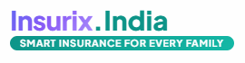
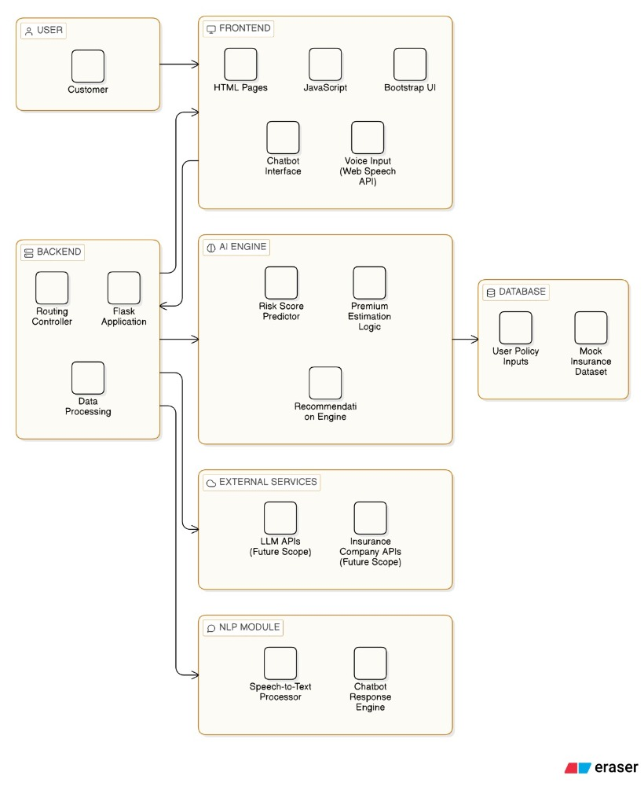
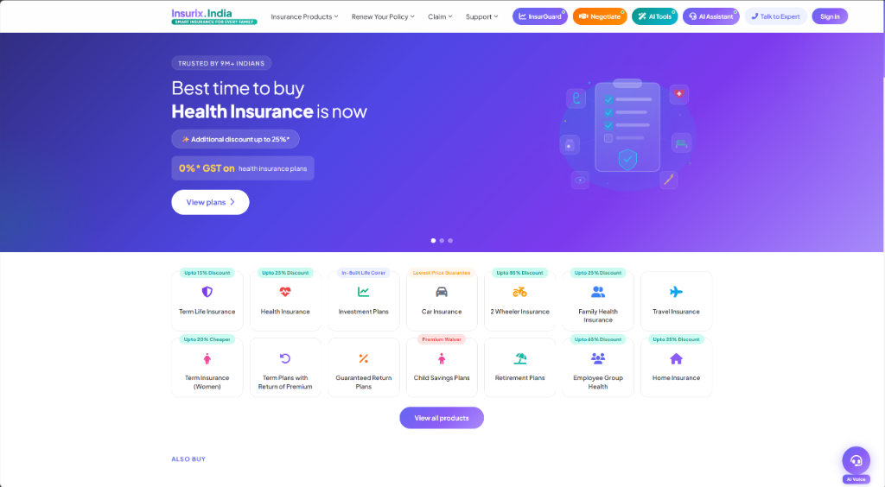
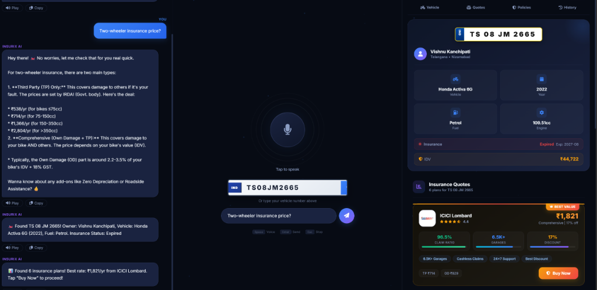
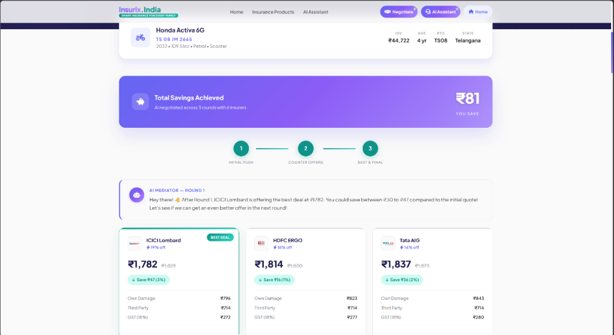
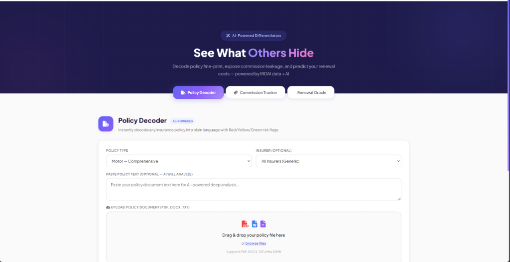

<div align="center">



# AI-Powered Smart Insurance Platform

**Smart Insurance for Every Indian Family**

[](https://nodejs.org/)
[](https://expressjs.com/)
[](https://openrouter.ai/)
[](https://azure.microsoft.com/en-us/services/cognitive-services/speech-services/)

</div>

---

## 📋 Project Description

Our solution is an **AI-powered web application** that simplifies insurance renewal by automating policy analysis and comparison. The user enters insurance details through a form or voice input, and the data is processed by a Node.js/Express backend. A rule-based AI model evaluates factors like premium, claim history, and coverage to generate a risk score and estimate better renewal options. The system then compares simulated policies from multiple insurers and displays the best recommendations in a clear dashboard. A chatbot is integrated to answer user queries and guide decision-making.

This approach demonstrates how **AI, automation, and conversational interfaces** can make insurance renewal faster, smarter, and more user-friendly.

### 🔑 Key Highlights

| Feature | Description |
|---------|-------------|
| 🤖 **AI Voice Assistant** | Multilingual chatbot (English, Telugu, Hindi) with speech recognition & text-to-speech |
| 🏍️ **Vehicle Detection** | Automatic vehicle number detection from voice/text with RTO data lookup |
| 📊 **Real-time Quotes** | Live insurance quotes from 6+ providers with price comparison |
| 🤝 **AI Negotiation** | 3-round automated negotiation engine that bargains with insurers for the best price |
| 🔍 **Policy Decoder** | AI-powered policy document analysis with Red/Yellow/Green risk flags |
| 🛡️ **Policy Cards** | Auto-detection and display of 14+ insurance policies when AI recommends them |
| 💳 **UPI Payment** | Integrated payment flow with policy issuance |
| 📱 **Responsive** | Works on desktop, tablet, and mobile devices |

---

## 🏗️ System Architecture



The architecture consists of 6 layers:

| Layer | Components | Description |
|-------|-----------|-------------|
| 👤 **User** | Customer | Interacts via browser (text, voice, or file upload) |
| 🖥️ **Frontend** | HTML Pages, JavaScript, UI, Chatbot Interface, Voice Input (Web Speech API) | Responsive UI with dark/light themes |
| ⚙️ **Backend** | Routing Controller, Express Application, Data Processing | Routes API calls, processes requests, serves static files |
| 🧠 **AI Engine** | Risk Score Predictor, Premium Estimation Logic, Recommendation Engine | Evaluates policies, compares premiums, generates recommendations |
| 🗄️ **Database** | User Policy Inputs, Mock Insurance Dataset | Stores user data and simulated insurer quotes |
| 🔌 **External Services** | LLM APIs (Gemini Flash), Insurance Company APIs | OpenRouter for AI chat, Azure for TTS |
| 🗣️ **NLP Module** | Speech-to-Text Processor, Chatbot Response Engine | Voice recognition + multilingual chatbot (EN/TE/HI) |

---

## 📸 UI Screenshots

### 1. Homepage — Insurance Product Marketplace



- **14 insurance product categories** (Term Life, Health, Car, 2-Wheeler, Travel, Home, etc.)
- Hero slider with health, life, and car insurance promotions
- Quick access buttons: InsurGuard, Negotiate, AI Tools, AI Assistant
- Partner logos, testimonials, and calculator tools

---

### 2. AI Voice Assistant — Multilingual Insurance Buddy



- **Voice-first interface** with speech recognition (English, Telugu, Hindi)
- Real-time vehicle number detection from spoken input
- **Right panel** shows: Vehicle details, Insurance quotes, Policy cards, History
- Automatic RTO data lookup (owner, vehicle model, fuel, insurance status)
- 6 live insurance quotes with "Buy Now" → UPI payment flow

---

### 3. AI Negotiation Engine — Automated Bargaining



- **3-round negotiation** (Initial Push → Counter Offers → Best & Final)
- AI Mediator bargains with 6 insurers simultaneously
- Live savings tracker (₹81 saved in example)
- Detailed premium breakdown: Own Damage + Third Party + GST
- "Best Deal" badge on the winning insurer

---

### 4. AI Tools — Policy Decoder & Commission Tracker



- **Policy Decoder**: Upload PDF/DOCX/TXT → AI decodes fine print with risk flags
- **Commission Tracker**: Expose hidden agent commissions across insurers
- **Renewal Oracle**: Predict your renewal premium before it arrives
- Powered by IRDAI data + Gemini AI

---

## 🚀 Quick Setup Guide

### Prerequisites

| Tool | Version | Download |
|------|---------|----------|
| **Node.js** | 18 or higher | [nodejs.org](https://nodejs.org/) |
| **npm** | Comes with Node.js | — |
| **Git** | Any recent version | [git-scm.com](https://git-scm.com/) |

### Step 1: Clone the Repository

```bash
git clone https://github.com/TheCraftsman1/KLH_Hackathon_FireFlies.git
cd KLH_Hackathon_FireFlies
```

### Step 2: Install Dependencies

```bash
npm install
```

This installs: `express`, `cors`, `axios`, `dotenv`, `multer`, `pdf-parse`, `mammoth`

### Step 3: Configure Environment Variables

The project includes a `.env.example` file with pre-configured API keys for hackathon evaluation.

```bash
# Windows (Command Prompt)
copy .env.example .env

# Windows (PowerShell)
Copy-Item .env.example .env

# macOS / Linux
cp .env.example .env
```

> **Note:** If you skip this step, the server will automatically use `.env.example` as a fallback.

The `.env` file contains:

```env
# OpenRouter API Key (Gemini Flash 2.0 for AI chatbot)
OPENROUTER_API_KEY=sk-or-v1-xxxxx

# Azure Speech Services (Text-to-Speech for Telugu/Hindi/English)
AZURE_SPEECH_KEY=xxxxx
AZURE_SPEECH_REGION=eastasia
```

### Step 4: Start the Server

```bash
node server.js
```

You should see:

```
Server running on http://localhost:3000
```

### Step 5: Open in Browser

Navigate to:

| Page | URL | Description |
|------|-----|-------------|
| 🏠 **Homepage** | [localhost:3000](http://localhost:3000) | Main insurance marketplace |
| 🎙️ **AI Assistant** | [localhost:3000/voice-assistant.html](http://localhost:3000/voice-assistant.html) | Voice chatbot with vehicle detection |
| 🤝 **Negotiation** | [localhost:3000/negotiation.html](http://localhost:3000/negotiation.html) | AI-powered premium negotiation |
| 🔍 **AI Tools** | [localhost:3000/ai-tools.html](http://localhost:3000/ai-tools.html) | Policy decoder, commission tracker |
| 📊 **InsurGuard** | [localhost:3000/dashboard.html](http://localhost:3000/dashboard.html) | Intelligence dashboard |

---

## 🎯 How to Test Key Features

### 🎙️ Test Voice Assistant
1. Go to `/voice-assistant.html`
2. Click the **mic button** and say: *"Two-wheeler insurance price?"*
3. Or type a vehicle number: `TS08JM2665`
4. Watch the **right panel** auto-populate with vehicle details + quotes
5. Ask about life insurance → policy cards appear in the **Policies tab**

### 🤝 Test AI Negotiation
1. Go to `/negotiation.html`
2. Enter vehicle number: `TS08JM2665`
3. Click **"Get Quotes"** → AI negotiates across 3 rounds
4. Watch premiums drop in real-time with savings displayed

### 🔍 Test Policy Decoder
1. Go to `/ai-tools.html`
2. Select **Policy Type** → paste any insurance policy text
3. Or upload a PDF/DOCX policy document
4. AI analyzes and outputs risk flags (🔴 Red / 🟡 Yellow / 🟢 Green)

### 🗣️ Test Telugu/Hindi
1. In Voice Assistant, click the **language button** (top-right)
2. Switch to **తెలుగు** (Telugu) or **हिन्दी** (Hindi)
3. Ask: *"లైఫ్ ఇన్సూరెన్స్ ప్లాన్‌లు చెప్పు"* (Tell me life insurance plans)

---

## 🛠️ Tech Stack

| Layer | Technology | Purpose |
|-------|-----------|---------|
| **Frontend** | HTML5, CSS3, Vanilla JS | UI, animations, voice recording |
| **Backend** | Node.js, Express.js | REST API, file processing |
| **AI Engine** | Gemini Flash 2.0 (via OpenRouter) | Chatbot, policy analysis, negotiation |
| **Voice** | Web Speech API + Azure TTS | Speech recognition + text-to-speech |
| **File Parsing** | pdf-parse, mammoth | PDF/DOCX policy document extraction |
| **Styling** | Custom CSS (dark theme + light theme) | Premium glassmorphism UI |

---

## 📁 Project Structure

```
KLH_Hackathon_FireFlies/
├── server.js                  # Main backend (Express + all API routes)
├── index.html                 # Homepage
├── voice-assistant.html       # AI Voice Assistant UI
├── voice-assistant.js         # Voice assistant logic + policy detection
├── voice-assistant.css        # Dark theme styles for voice assistant
├── negotiation.html/js/css    # AI Negotiation engine
├── ai-tools.html/js/css       # Policy Decoder, Commission Tracker
├── dashboard.html             # InsurGuard Intelligence Dashboard
├── styles.css                 # Main site styles
├── script.js                  # Main site interactivity
├── vehicle-api.js             # Vehicle RTO data lookup
├── chatbot.js                 # Floating chatbot widget
├── calculators.js             # Health & financial calculators
├── .env.example               # API keys (copy to .env)
├── assets/                    # Insurer logos, images
├── docs/                      # Architecture diagrams, screenshots
└── package.json               # Dependencies
```

---

## 👥 Team — FireFlies 🔥

**KLH Hackathon 2026**

---

## 📄 License

This project was built for the KLH Hackathon competition. All rights reserved by Team FireFlies.
